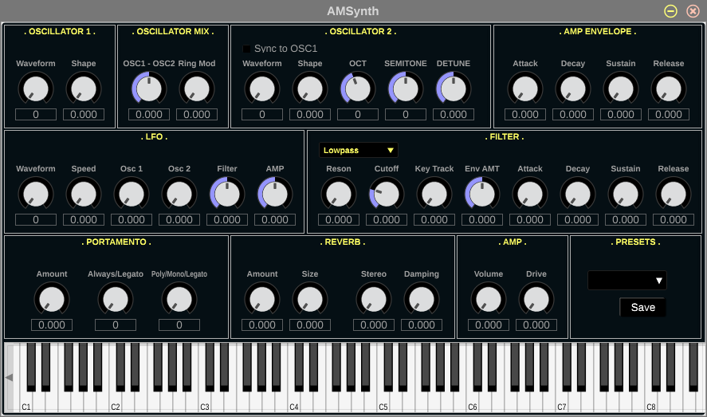

csound-synths
=============

License
-------

MIT License

How to run
----------

Download the release files `amsyth.so` and `amsyth.csd` and place them in vst2 folder `$HOME/.vst`

Development
-----------

Open `amsynth.carxp` file in Carla

Run amsynth:

    ./amsynth

Saving amsynth settings in carla causes csound synth to update settings
